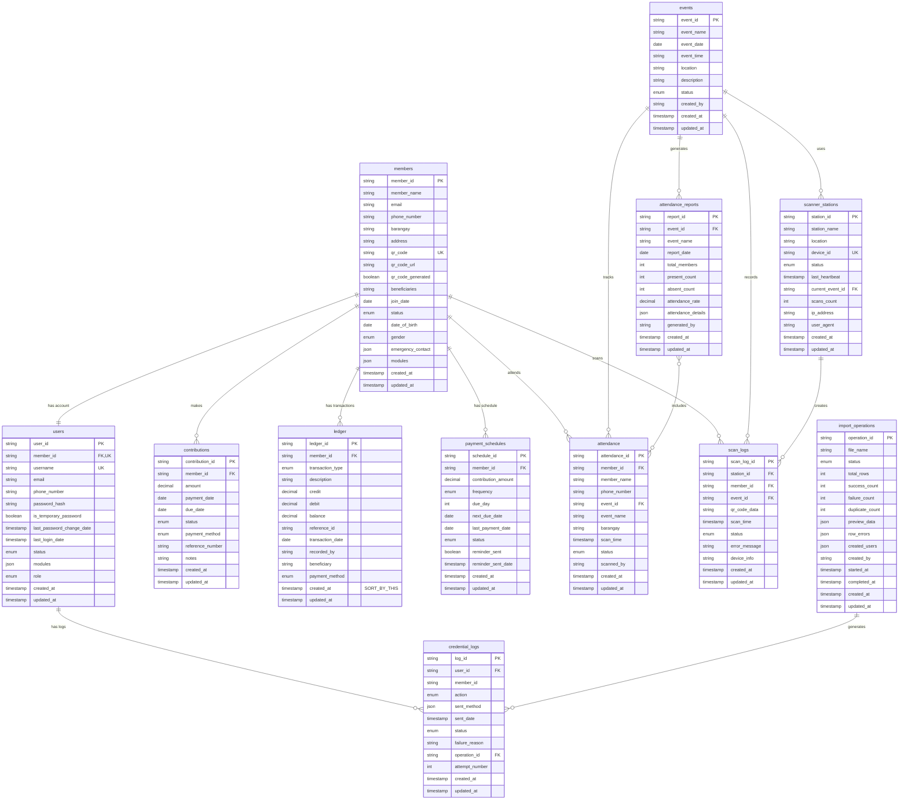

# Entity Relationship Diagram (ERD)
## SVMPC Cooperative Management System

---

## 📊 VISUAL ERD DIAGRAM

### ASCII Art ERD (Simplified View)

```
┌─────────────────────────────────────────────────────────────────────────────────┐
│                         SVMPC COOPERATIVE DATABASE SCHEMA                        │
│                                  12 Tables Total                                 │
└─────────────────────────────────────────────────────────────────────────────────┘

┌──────────────────────────────────────────────────────────────────────────────────┐
│                              SHARED/CORE MODULE                                   │
└──────────────────────────────────────────────────────────────────────────────────┘

    ┌─────────────────────────┐
    │   import_operations     │
    ├─────────────────────────┤
    │ PK operation_id         │
    │    file_name            │
    │    status               │
    │    total_rows           │
    │    success_count        │
    │    created_by           │
    │    started_at           │
    │    completed_at         │
    └─────────────────────────┘
              │
              │ 1:N
              ▼
    ┌─────────────────────────┐
    │   credential_logs       │
    ├─────────────────────────┤
    │ PK log_id               │
    │ FK user_id              │────┐
    │    member_id            │    │
    │ FK operation_id         │    │
    │    action               │    │
    │    sent_method          │    │
    │    status               │    │
    └─────────────────────────┘    │
                                   │
                                   │
    ┌──────────────────────────────┼──────────────────────────────┐
    │                              │                              │
    │                              ▼                              │
    │                    ┌─────────────────────────┐             │
    │                    │        users            │             │
    │                    ├─────────────────────────┤             │
    │                    │ PK user_id              │             │
    │                    │ FK member_id (UNIQUE)   │─────┐       │
    │                    │    username (UNIQUE)    │     │       │
    │                    │    email                │     │       │
    │                    │    password_hash        │     │       │
    │                    │    role                 │     │       │
    │                    │    status               │     │       │
    │                    │    modules              │     │       │
    │                    └─────────────────────────┘     │       │
    │                                                    │ 1:1   │
    │                                                    ▼       │
    │                              ┌─────────────────────────────────────┐
    │                              │           members (CORE)            │
    │                              ├─────────────────────────────────────┤
    │                              │ PK member_id                        │
    │                              │    member_name                      │
    │                              │    email                            │
    │                              │    phone_number                     │
    │                              │    barangay                         │
    │                              │    address                          │
    │                              │    qr_code (UNIQUE)                 │
    │                              │    qr_code_url                      │
    │                              │    beneficiaries                    │
    │                              │    status                           │
    │                              │    join_date                        │
    │                              │    modules                          │
    │                              └─────────────────────────────────────┘
    │                                              │
    │                                              │ 1:N
    │                                              │
    ├──────────────────────────────────────────────┼──────────────────────────────┐
    │                                              │                              │
    │                                              │                              │
┌───┴──────────────────────────────────────────────┴──────────────────────────────┴───┐
│                              MORTUARY MODULE                                         │
└──────────────────────────────────────────────────────────────────────────────────────┘
    │                              │                              │
    ▼                              ▼                              ▼
┌─────────────────────────┐  ┌─────────────────────────┐  ┌─────────────────────────┐
│    contributions        │  │        ledger           │  │   payment_schedules     │
├─────────────────────────┤  ├─────────────────────────┤  ├─────────────────────────┤
│ PK contribution_id      │  │ PK ledger_id            │  │ PK schedule_id          │
│ FK member_id            │  │ FK member_id            │  │ FK member_id            │
│    amount               │  │    transaction_type     │  │    contribution_amount  │
│    payment_date         │  │    description          │  │    frequency            │
│    due_date             │  │    credit               │  │    due_day              │
│    status               │  │    debit                │  │    next_due_date        │
│    payment_method       │  │    balance ⭐           │  │    last_payment_date    │
│    reference_number     │  │    transaction_date     │  │    status               │
│    notes                │  │    created_at ⭐⭐      │  │    reminder_sent        │
└─────────────────────────┘  │    recorded_by          │  └─────────────────────────┘
                             │    beneficiary          │
                             │    payment_method       │
                             └─────────────────────────┘
                             ⭐ Running balance
                             ⭐⭐ CRITICAL: Sort by this!

┌──────────────────────────────────────────────────────────────────────────────────┐
│                            ATTENDANCE MODULE                                      │
└──────────────────────────────────────────────────────────────────────────────────┘

                              ┌─────────────────────────┐
                              │        events           │
                              ├─────────────────────────┤
                              │ PK event_id             │
                              │    event_name           │
                              │    event_date           │
                              │    event_time           │
                              │    location             │
                              │    description          │
                              │    status               │
                              │    created_by           │
                              └─────────────────────────┘
                                        │
                                        │ 1:N
                    ┌───────────────────┼───────────────────┐
                    │                   │                   │
                    ▼                   ▼                   ▼
        ┌─────────────────────┐ ┌─────────────────┐ ┌──────────────────────┐
        │    attendance       │ │ attendance_     │ │  scanner_stations    │
        ├─────────────────────┤ │ reports         │ ├──────────────────────┤
        │ PK attendance_id    │ ├─────────────────┤ │ PK station_id        │
        │ FK member_id        │ │ PK report_id    │ │    station_name      │
        │ FK event_id         │ │ FK event_id     │ │    location          │
        │    member_name      │ │    event_name   │ │    device_id (UNIQUE)│
        │    event_name       │ │    report_date  │ │    status            │
        │    barangay         │ │    total_members│ │    last_heartbeat    │
        │    scan_time        │ │    present_count│ │ FK current_event_id  │
        │    status           │ │    absent_count │ │    scans_count       │
        │    scanned_by       │ │    attendance_  │ │    ip_address        │
        └─────────────────────┘ │    rate         │ └──────────────────────┘
                │               │    generated_by │            │
                │               └─────────────────┘            │
                │                        │                     │
                │                        │ References          │
                │                        │ (JSON Array)        │
                │                        ▼                     │
                └────────────────────────┘                     │
                                                               │ 1:N
                                                               ▼
                                                    ┌─────────────────────┐
                                                    │    scan_logs        │
                                                    ├─────────────────────┤
                                                    │ PK scan_log_id      │
                                                    │ FK station_id       │
                                                    │ FK member_id        │
                                                    │ FK event_id         │
                                                    │    qr_code_data     │
                                                    │    scan_time        │
                                                    │    status           │
                                                    │    error_message    │
                                                    │    device_info      │
                                                    └─────────────────────┘
```

---

## 🎨 MERMAID ERD DIAGRAM

### Copy this code to visualize in:
- GitHub (supports Mermaid)
- Mermaid Live Editor (https://mermaid.live)
- VS Code with Mermaid extension
- Notion, Confluence, GitLab



---

## 🔗 DETAILED RELATIONSHIP DIAGRAM

### Crow's Foot Notation Legend
```
│   = One (exactly one)
○   = Zero or one (optional)
├   = One or more (at least one)
○<  = Zero or more (optional many)
```

### Complete Relationship Map

```
┌──────────────────────────────────────────────────────────────────────────┐
│                         RELATIONSHIP CARDINALITY                          │
└──────────────────────────────────────────────────────────────────────────┘

SHARED/CORE RELATIONSHIPS:
━━━━━━━━━━━━━━━━━━━━━━━━━━━

users (1) ──────────────────── (1) members
  │                                  │
  │ user_id                          │ member_id
  │                                  │
  └──> member_id (FK, UNIQUE)        └──> Referenced by multiple tables

members (1) ──────────────────── (0..N) contributions
members (1) ──────────────────── (0..N) ledger
members (1) ──────────────────── (0..N) payment_schedules
members (1) ──────────────────── (0..N) attendance
members (1) ──────────────────── (0..N) scan_logs

import_operations (1) ────────── (0..N) credential_logs
users (1) ───────────────────── (0..N) credential_logs


MORTUARY MODULE RELATIONSHIPS:
━━━━━━━━━━━━━━━━━━━━━━━━━━━━━━

members (1) ──────────────────── (0..N) contributions
  │                                       │
  └─> member_id                           └─> member_id (FK)
      One member can have many contributions

members (1) ──────────────────── (0..N) ledger
  │                                       │
  └─> member_id                           └─> member_id (FK)
      One member has many ledger entries (transaction history)

members (1) ──────────────────── (0..N) payment_schedules
  │                                       │
  └─> member_id                           └─> member_id (FK)
      One member can have multiple payment schedules


ATTENDANCE MODULE RELATIONSHIPS:
━━━━━━━━━━━━━━━━━━━━━━━━━━━━━━━━

events (1) ────────────────────── (0..N) attendance
  │                                       │
  └─> event_id                            └─> event_id (FK)
      One event has many attendance records

events (1) ────────────────────── (0..N) attendance_reports
  │                                       │
  └─> event_id                            └─> event_id (FK)
      One event can have multiple reports

events (1) ────────────────────── (0..N) scanner_stations
  │                                       │
  └─> event_id                            └─> current_event_id (FK, nullable)
      One event can be active on multiple stations

events (1) ────────────────────── (0..N) scan_logs
  │                                       │
  └─> event_id                            └─> event_id (FK)
      One event generates many scan logs

scanner_stations (1) ─────────── (0..N) scan_logs
  │                                       │
  └─> station_id                          └─> station_id (FK)
      One station creates many scan logs

members (1) ──────────────────── (0..N) attendance
  │                                       │
  └─> member_id                           └─> member_id (FK)
      One member attends many events

members (1) ──────────────────── (0..N) scan_logs
  │                                       │
  └─> member_id                           └─> member_id (FK)
      One member generates many scan logs

attendance_reports (1) ─────────── (0..N) attendance
  │                                       │
  └─> attendance_details (JSON)           └─> attendance_id
      One report includes many attendance records (Many-to-Many via JSON)
```

---

## 📊 MODULE DEPENDENCY DIAGRAM

```
┌─────────────────────────────────────────────────────────────────────────┐
│                         MODULE ARCHITECTURE                              │
└─────────────────────────────────────────────────────────────────────────┘

                    ┌──────────────────────────┐
                    │     SHARED/CORE          │
                    │                          │
                    │  • members (CENTRAL)     │
                    │  • users                 │
                    │  • import_operations     │
                    │  • credential_logs       │
                    └────────────┬─────────────┘
                                 │
                                 │ Provides base data
                                 │
                ┌────────────────┴────────────────┐
                │                                 │
                ▼                                 ▼
    ┌───────────────────────┐       ┌───────────────────────┐
    │   MORTUARY MODULE     │       │  ATTENDANCE MODULE    │
    │                       │       │                       │
    │  • contributions      │       │  • events             │
    │  • ledger             │       │  • attendance         │
    │  • payment_schedules  │       │  • attendance_reports │
    │                       │       │  • scanner_stations   │
    │                       │       │  • scan_logs          │
    └───────────────────────┘       └───────────────────────┘
         Financial tracking              Event tracking
         Balance management              QR code scanning
         Payment schedules               Attendance reports
```

---

## 🎯 KEY RELATIONSHIPS SUMMARY

### Critical Relationships

1. **User Authentication Flow**
   ```
   users.member_id → members.member_id (1:1 UNIQUE)
   ```

2. **Member Financial History**
   ```
   members.member_id → contributions.member_id (1:N)
   members.member_id → ledger.member_id (1:N)
   ```

3. **Event Attendance Tracking**
   ```
   events.event_id → attendance.event_id (1:N)
   members.member_id → attendance.member_id (1:N)
   ```

4. **QR Scanning Flow**
   ```
   scanner_stations.station_id → scan_logs.station_id (1:N)
   members.member_id → scan_logs.member_id (1:N)
   events.event_id → scan_logs.event_id (1:N)
   ```

5. **Import Operations Tracking**
   ```
   import_operations.operation_id → credential_logs.operation_id (1:N)
   users.user_id → credential_logs.user_id (1:N)
   ```

---

## 📝 REFERENTIAL INTEGRITY RULES

### ON DELETE Rules

| Parent Table | Child Table | Rule | Reason |
|-------------|-------------|------|--------|
| members | users | RESTRICT | Cannot delete member with active user account |
| members | contributions | CASCADE | Delete contributions when member deleted |
| members | ledger | CASCADE | Delete ledger entries when member deleted |
| members | attendance | CASCADE | Delete attendance records when member deleted |
| events | attendance | CASCADE | Delete attendance when event deleted |
| events | scanner_stations | SET NULL | Clear current_event_id when event deleted |
| scanner_stations | scan_logs | CASCADE | Delete scan logs when station deleted |
| import_operations | credential_logs | SET NULL | Keep logs even if import operation deleted |

### ON UPDATE Rules

All foreign keys use **CASCADE** on update to maintain referential integrity when IDs change.

---

## 🔍 INDEXES FOR PERFORMANCE

### Critical Indexes

```sql
-- Most important for performance
CREATE INDEX idx_ledger_member_created ON ledger(member_id, created_at DESC);
CREATE UNIQUE INDEX idx_attendance_event_member ON attendance(event_id, member_id);
CREATE INDEX idx_contributions_member_date ON contributions(member_id, payment_date DESC);
CREATE INDEX idx_scan_logs_event_time ON scan_logs(event_id, scan_time DESC);
```

---

## 📐 NORMALIZATION LEVEL

**Database Normalization:** 3NF (Third Normal Form)

**Intentional Denormalization:**
- `attendance.member_name` (copied from members)
- `attendance.event_name` (copied from events)
- `attendance_reports.event_name` (copied from events)

**Reason:** Performance optimization for read-heavy operations

---

## 🎨 COLOR CODING FOR VISUAL ERD

### Recommended Colors

- **🔵 Blue:** Shared/Core tables (members, users, import_operations, credential_logs)
- **🟢 Green:** Mortuary module (contributions, ledger, payment_schedules)
- **🟠 Orange:** Attendance module (events, attendance, attendance_reports, scanner_stations, scan_logs)

### Relationship Line Colors

- **Black:** Primary relationships (1:1, 1:N)
- **Gray:** Optional relationships (0..N)
- **Red:** Critical relationships (user-member, member-ledger)

---

## 📊 STATISTICS & METRICS

### Table Complexity Ranking

1. **members** - Central hub (referenced by 7 tables)
2. **events** - Referenced by 4 tables
3. **ledger** - Most complex business logic
4. **attendance** - Multiple foreign keys
5. **scan_logs** - Highest volume table

### Relationship Count

- **Total Relationships:** 15
- **One-to-One:** 1 (users ↔ members)
- **One-to-Many:** 14
- **Many-to-Many:** 1 (attendance_reports ↔ attendance via JSON)

---

**Document Version:** 1.0  
**Last Updated:** 2026-05-06  
**Total Tables:** 12  
**Total Relationships:** 15
